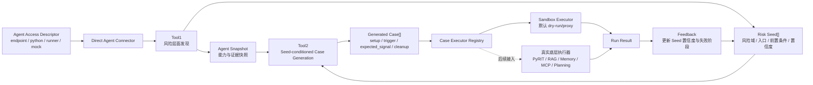
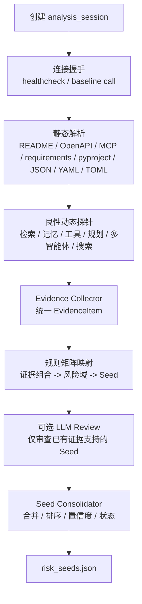
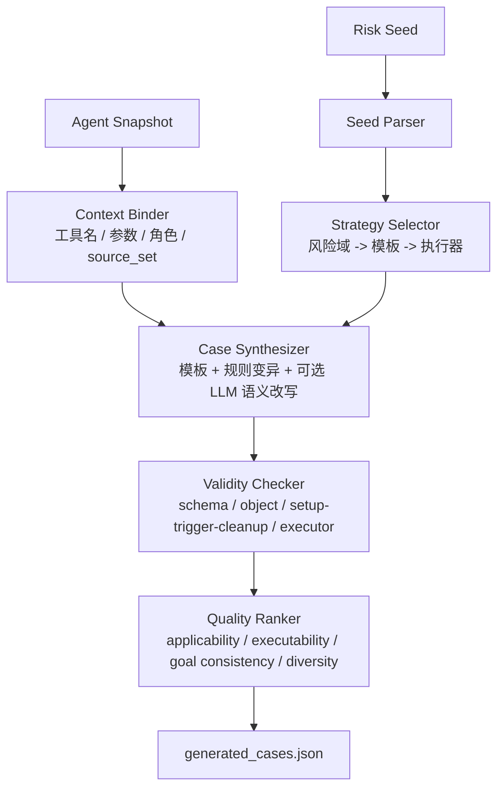

# AgentEVAL Risk Tools

AgentEVAL Risk Tools 是一个面向 LLM Agent 安全评测的上层编排原型，核心目标是把分散的攻击方法组织成统一的两阶段流程：

```text
待测 Agent -> Tool1 风险层面发现 -> Tool2 测试用例生成 -> 执行器/结果反馈
```

Tool1 负责根据待测 Agent 的访问描述、静态材料和良性动态探针发现候选风险层面，输出带证据的 Risk Seed。Tool2 读取 Risk Seed 与 Agent Snapshot，生成结构化、可校验、带 provenance 的测试用例。底层真实攻击执行器可以后续通过 executor registry 接入；当前默认使用确定性 sandbox executor 做 dry-run/proxy 验证。

## 总体架构



## Tool1 流程

Tool1 的定位是“证据驱动的候选风险发现器”，不是直接证明漏洞存在。它输出的是值得测试的风险假设，并保留每个判断对应的 evidence_id。



当前覆盖的风险域包括：

- `prompt_context_injection`
- `rag_poisoning`
- `memory_poisoning`
- `tool_output_injection`
- `mcp_description_poisoning`
- `planning_poisoning`
- `multi_agent_communication_poisoning`
- `search_narrative_poisoning`

## Tool2 流程

Tool2 的定位是“基于 Risk Seed 和 Agent Snapshot 的测试用例生成器”。它不让 LLM 自由决定结构，而是先选择模板骨架，再绑定目标上下文，最后做结构校验和 dry-run 校验。



每个 Generated Case 包含：

- `case_id`、`seed_id`、`attack_family`
- `delivery_mode`
- `setup`、`trigger`、`expected_signal`、`cleanup`
- `executor`
- `quality_score`
- `provenance`
- `validation_result`

## 目录结构

```text
src/agenteval/
  tool1/              Tool1 风险发现
  tool2/              Tool2 用例生成
  connectors.py       HTTP / Python / runner / mock 连接器
  static_analysis.py  静态材料解析
  experiment.py       executor registry 与 sandbox executor
  feedback.py         结果反馈闭环
  evaluation.py       Tool1/Tool2 论文实验指标
  api.py              FastAPI 接口
  cli.py              命令行入口

examples/
  current_framework_agents.json  当前框架 agent descriptor 示例
  direct_agent_sample.json       本地 Python Agent 示例

tests/
  test_end_to_end.py             端到端测试
```

## 环境安装

推荐使用独立 conda 环境：

```powershell
conda create -n agenteval-tool12 python=3.11 -y
conda activate agenteval-tool12

Set-Location F:\Project\AgentEVAL

python -m pip install --upgrade pip setuptools wheel
python -m pip install -e .
python -m pip install httpx "uvicorn[standard]"
```

## 快速运行

```powershell
$env:PYTHONPATH="src"
python -m agenteval.cli run-demo --out runs/demo --count 1 --no-llm-review --no-llm-variants
```

典型输出：

- `analysis_session.json`
- `agent_snapshot.json`
- `risk_seeds.json`
- `generated_cases.json`
- `run_result.json`
- `summary.json`

## 常用命令

分析单个 Agent：

```powershell
python -m agenteval.cli analyze-agent --descriptor examples/current_framework_agents.json --agent SimpleRAGChatbot --out runs/simple_rag
```

基于 Seed 生成 Case：

```powershell
python -m agenteval.cli generate-cases --analysis-dir runs/simple_rag --count 3
```

执行 sandbox dry-run：

```powershell
python -m agenteval.cli run-cases --analysis-dir runs/simple_rag
```

把执行结果反馈到 Seed：

```powershell
python -m agenteval.cli apply-feedback --analysis-dir runs/simple_rag
```

汇总运行结果：

```powershell
python -m agenteval.cli summarize --run-root runs/demo
```

生成 Markdown 报告：

```powershell
python -m agenteval.cli write-report --run-root runs/demo --out runs/demo/report.md
```

## DeepSeek LLM 模式

Tool1 和 Tool2 可以选择调用 DeepSeek JSON 接口。API Key 只从环境变量读取，不应写入代码、README、JSON 输出或测试文件。

```powershell
$env:PYTHONPATH="src"
$env:DEEPSEEK_API_KEY="<your-deepseek-key>"
$env:DEEPSEEK_MODEL="deepseek-v4-pro"

python -m agenteval.cli run-demo --out runs/demo_llm --llm-review --llm-variants
```

LLM 使用边界：

- Tool1 只对低置信度或需要自然语言理解的已有 Seed 做结构化审查。
- Tool1 不允许 LLM 生成没有 evidence_id 支撑的新风险。
- Tool2 只允许 LLM 改写 `setup` 和 `trigger` 中的自然语言内容。
- Tool2 不允许 LLM 修改 executor、工具名、expected_signal、cleanup、ID 或顶层结构。
- LLM 失败或输出非法 JSON 时，流程会记录 provenance 并回退到确定性模板。

## FastAPI 接口

```powershell
$env:PYTHONPATH="src"
uvicorn agenteval.api:app --reload
```

接口列表：

- `POST /api/risk-discovery/analyze`
- `GET /api/analysis-sessions/{analysis_id}`
- `POST /api/case-generation/generate`
- `GET /api/generation-jobs/{job_id}`
- `POST /api/experiments/from-seeds`
- `POST /api/results/{run_id}/feedback`

接口用于后续前端接入：风险画像、Seed 证据抽屉、Case 生成任务状态、Seed -> Case -> Run 链路展示。

## Tool1/Tool2 论文实验

`evaluate-tool12` 用于生成透明的 Tool1/Tool2 功能贡献指标。标签来源必须是显式输入：可以传入 labels 文件，也可以使用 descriptor 中的 `expected_domains`。

```powershell
$env:PYTHONPATH="src"
python -m agenteval.cli evaluate-tool12 --descriptors examples/current_framework_agents.json --out runs/tool12_eval --count 1 --no-llm-review --no-llm-variants
```

输出文件：

- `tool1_metrics.json` / `tool1_metrics.csv`
- `tool2_metrics.json` / `tool2_metrics.csv`
- `baseline_metrics.json` / `baseline_metrics.csv`
- `ablation_metrics.json` / `ablation_metrics.csv`
- `evaluation_summary.json`
- `paper_tables.md`

支持的对比实验：

- `ours`
- `all_domains`
- `random_domains`
- `fixed_template`
- `direct_llm`，需要设置 `DEEPSEEK_API_KEY`

支持的消融实验：

- `ours_full`
- `w/o_static_parsing`
- `w/o_dynamic_probe`
- `w/o_llm_review`
- `w/o_context_binding`
- `w/o_dry_run`
- `w/o_feedback`

注意：sandbox 输出只表示 dry-run/proxy 指标，不能写成真实 ASR。真实 ASR 需要从底层真实执行器或人工整理表导入。

## 导入论文结果表

如果已有真实底层攻击结果或人工整理结果，可以用 `import-paper-results` 做格式化、汇总和 Markdown 表格生成。

```powershell
python -m agenteval.cli import-paper-results --input path\manual_results.csv --out runs/paper_tables
```

建议输入字段：

- `agent_ref`
- `method`
- `risk_domain`
- `seed_precision`
- `seed_recall`
- `schema_valid_rate`
- `dry_run_valid_rate`
- `asr`
- `source`，例如 `manual`、`real_executor`、`dry_run_proxy`

## 真实执行器接入

当前默认执行器是 deterministic sandbox。真实底层攻击执行器可以实现 `CaseExecutor` 并注册到 `ExecutorRegistry`：

```python
from agenteval.experiment import CaseExecutor, DEFAULT_EXECUTOR_REGISTRY


class RealRagExecutor(CaseExecutor):
    name = "rag_poison_runner"

    def run(self, analysis_id, cases):
        ...


DEFAULT_EXECUTOR_REGISTRY.register("rag_poison_runner", RealRagExecutor())
```

Tool2 生成的 case 会根据 `executor` 字段选择执行器。如果目标执行器没有注册，系统会回退到 sandbox，并在 result provenance 中记录 `fallback_reason`。

## 测试

```powershell
$env:PYTHONPATH="src"
$env:PYTHONDONTWRITEBYTECODE="1"
python -B -m unittest discover -s tests -v
```

当前测试覆盖：

- Tool1 风险发现与证据绑定
- Tool2 case 生成、LLM 受限变体与 dry-run 校验
- executor registry fallback
- feedback 置信度更新
- FastAPI analyze/generate/run/feedback 链路
- Tool1/Tool2 论文指标输出
- 导入显式论文结果表

## 方法边界

- Tool1 输出的是候选风险层面，不等同于已经证明漏洞存在。
- Tool2 生成的是结构化测试用例，不声称底层攻击算法全部由本工具重新发明。
- 当前 sandbox 结果不能作为真实攻击成功率。
- 真实 ASR、防御效果和业务影响指标应来自真实底层执行器或明确来源的导入表。
