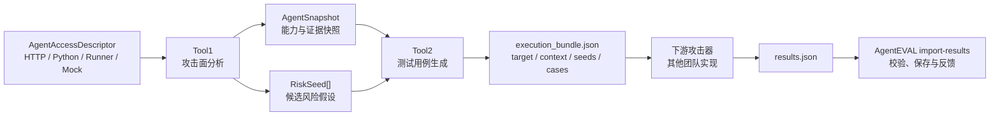

# AgentEVAL

AgentEVAL 是一个上游安全评测编排器：输入待测 Agent 的访问说明，由 Tool1 发现有证据支撑的候选攻击面，再由 Tool2 生成结构化测试用例，最后把统一的 `execution_bundle.json` 交给下游攻击器执行。

```text
Agent 描述 -> Tool1 -> Risk Seed -> Tool2 -> Case -> 下游执行器 -> Result
```

> AgentEVAL 默认只生成测试交付包，不会执行真实攻击。只有显式传入 `--execute-sandbox` 时才运行确定性代理沙箱；沙箱结果不是实际攻击成功率（ASR）。

## 系统流程



Tool1 输出候选风险面，不等于已经证明漏洞存在；Tool2 输出安全、结构化的测试用例，不等于真实攻击已经成功。

## 本地快速开始

要求 Python 3.10 或更高版本。以下命令使用 PowerShell：

```powershell
python -m venv .venv
.\.venv\Scripts\Activate.ps1
python -m pip install --upgrade pip
python -m pip install -e .

agenteval run `
  --input examples/demo.json `
  --out runs/quickstart `
  --count 1 `
  --llm off
```

命令默认运行到 Tool2，并生成：

```text
runs/quickstart/
  analysis_session.json
  agent_snapshot.json
  risk_seeds.json
  generated_cases.json
  execution_bundle.json
  pipeline_summary.json
```

若只想验证本项目的执行与反馈闭环，可以显式运行代理沙箱：

```powershell
agenteval run `
  --input examples/demo.json `
  --out runs/sandbox-smoke `
  --count 1 `
  --llm off `
  --execute-sandbox
```

此时会额外生成 `run_result.json`。其中的 `sandbox_attack_success` 仅为确定性代理指标，不能写成真实 ASR。

## 回传下游结果

下游执行器读取 `execution_bundle.json`，完成实际测试后返回 JSON。下面只展示一条结果；实际 `results` 必须覆盖 bundle 中全部 case：

```json
{
  "results": [
    {
      "case_id": "case_seed_xxx_v01_xxxxxxxx",
      "failure_stage": "not_triggered",
      "metrics": {
        "real_attack_success": false,
        "latency_ms": 1250
      }
    }
  ]
}
```

导入结果：

```powershell
agenteval import-results `
  --analysis-dir runs/quickstart `
  --results path\to\results.json
```

`analysis_id`、`seed_id` 等关联字段由 AgentEVAL 根据 `case_id` 补齐并校验。下游必须为 bundle 中每条 case 返回一条结果；每条最小结果只需提供 `case_id`、`failure_stage` 和 `metrics`。

## Docker

启动 API：

```powershell
docker compose up --build -d
Invoke-RestMethod http://127.0.0.1:8000/healthz
```

镜像默认运行 API 服务。要在容器内执行 CLI，直接覆盖为 `run` 命令：

```powershell
docker build -t agenteval:latest .

docker run --rm `
  -v "${PWD}\runs:/app/runs" `
  agenteval:latest `
  run --input examples/demo.json --out runs/docker-quickstart --count 1 --llm off
```

若待测 Agent 运行在 Windows/macOS 宿主机，容器中的 descriptor 应使用 `host.docker.internal`，不能使用 `127.0.0.1`。

## API

新版 API 的主路径是：

```text
POST /api/v1/evaluations
GET  /api/v1/evaluations/{evaluation_id}
POST /api/v1/evaluations/{evaluation_id}/results
GET  /healthz
```

API 默认只接受 `mock` 和 `http` 目标；`python`、`runner` 会执行本地代码或进程，因此默认禁用。不要把 AgentEVAL API 未经认证直接暴露到公网。

## 当前风险域

- `prompt_context_injection`
- `rag_poisoning`
- `memory_poisoning`
- `tool_output_injection`
- `mcp_description_poisoning`
- `planning_poisoning`
- `multi_agent_communication_poisoning`
- `search_narrative_poisoning`

## 文档导航

- [使用指南](doc/使用指南.md)：CLI、Docker、API、Python 与 Agent descriptor。
- [下游执行器接入说明](doc/接入说明.md)：`execution_bundle.json`、八类 case 字段与结果回传协议。
- [Tool1 内部设计](doc/TOOL1_README.md)：证据收集与 Risk Seed 推断。
- [Tool2 内部设计](doc/TOOL2_README.md)：case 生成、校验和 refinement。
- [Prompt 说明](src/agenteval/prompts/README.md)：受限 LLM Prompt 的维护位置。

## 开发验证

```powershell
python -m pip install -e ".[test,yaml]"
$env:PYTHONDONTWRITEBYTECODE="1"
python -B -m unittest discover -s tests -v
```

项目当前仍是比赛原型。真实攻击效果、防御效果与业务影响必须由下游真实执行器提供，并在结果中明确记录数据来源。
