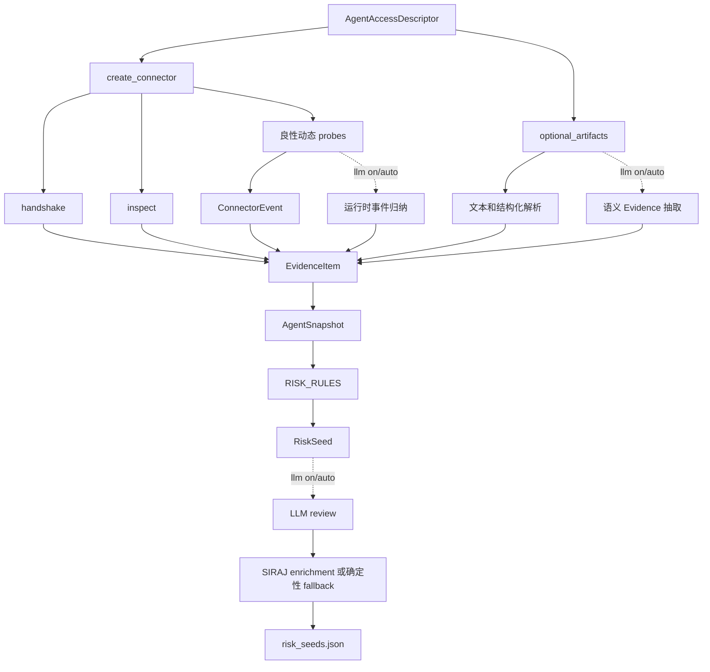

# Tool1 内部设计说明

本文面向维护 AgentEVAL 核心代码的开发者。普通使用方式见[使用指南](使用指南.md)，下游执行器无需依赖 Tool1 内部实现。

## 1. 定位

Tool1 是证据驱动的候选攻击面分析器：

```text
AgentAccessDescriptor
  -> 连接与静态/动态观察
  -> AgentSnapshot + EvidenceItem[]
  -> 确定性风险规则
  -> RiskSeed[]
```

它输出“值得继续测试的风险假设”，不证明漏洞已经存在，也不执行真实攻击。

核心代码：

- `src/agenteval/tool1/analyzer.py`：主流程。
- `src/agenteval/tool1/rules.py`：Evidence → Risk Seed 规则。
- `src/agenteval/tool1/semantic.py`：受限语义 evidence 校验。
- `src/agenteval/tool1/runtime.py`：运行时事件归纳与校验。
- `src/agenteval/tool1/siraj.py`：Seed enrichment 与确定性 fallback。
- `src/agenteval/connectors.py`：Agent connector。
- `src/agenteval/schemas.py`：公共数据结构。

## 2. 数据流



## 3. 输入

唯一输入边界是 `AgentAccessDescriptor`。主要字段：

| 字段 | 用途 |
| --- | --- |
| `agent_ref` | 目标稳定标识。 |
| `protocol` | 选择 mock、HTTP、Python 或 runner connector。 |
| `endpoint` / `request_template` / `response_key` | HTTP 或 callable 的请求响应适配。 |
| `inspect` | healthcheck、OpenAPI 或 schema 探测。 |
| `static_artifacts` | 已知能力、工具、RAG、memory 等结构化信息。 |
| `optional_artifacts` | 文件路径或内联文本证据。 |
| `sandbox_policy` | 安全探针边界。 |

API 默认只允许 `mock` 和 `http`。`python`、`runner` 只允许在受信任本地 CLI 环境使用。

## 4. 主要阶段

| 阶段 | 产物 | 设计约束 |
| --- | --- | --- |
| Connector 创建 | 统一连接对象 | 不在 Tool1 中写协议特例。 |
| handshake | 连接状态 evidence | 只证明目标可访问。 |
| inspect | 能力、工具、API spec | 与 descriptor 静态材料合并。 |
| optional artifacts | 文本/结构化 evidence | 每条 evidence 保留来源。 |
| benign probes | runtime observations | 只发送安全探针。 |
| runtime mapping | runtime evidence | connector 原生事件优先。 |
| snapshot | `AgentSnapshot` | 汇总能力、工具、观测和 evidence。 |
| rule inference | `RiskSeed[]` | 风险方向由确定性规则决定。 |
| optional review | seed 分数/状态修订 | 不能新增 seed。 |
| SIRAJ enrichment | outcome/source/trajectory | 不能改变 seed 风险域。 |

Connector 必须在异常路径也执行 `close()`；有状态 connector 在 probe 之间应按设计调用 `reset()`，避免跨探针污染。

## 5. EvidenceItem

每条 evidence 至少包含：

```json
{
  "evidence_id": "ev_xxx",
  "analysis_id": "analysis_xxx",
  "source_type": "static_descriptor",
  "source_location": "descriptor.capabilities",
  "feature": "rag_enabled",
  "value": true,
  "confidence": 0.9,
  "detail": "..."
}
```

核心不变量：

- Risk Seed 必须引用真实存在的 `evidence_id`。
- LLM 语义 evidence 必须使用白名单 feature，并提供能在原文中定位的摘录。
- LLM runtime event 必须使用白名单事件，并绑定本轮响应证据。
- 没有证据时不得仅凭模型常识创造能力或风险。

## 6. AgentSnapshot

`AgentSnapshot` 是 Tool1 后半段和 Tool2 的共享观察基础：

```text
analysis_id
agent_ref
connector_type
capabilities
api_spec
tool_schemas
runtime_observations
evidence_index
```

对 snapshot 字段的变更会直接影响 Tool2 上下文绑定和下游交付包，应保持向后兼容。

## 7. Risk Seed 推断

规则位于 `RISK_RULES`，当前覆盖：

- `prompt_context_injection`
- `rag_poisoning`
- `memory_poisoning`
- `tool_output_injection`
- `mcp_description_poisoning`
- `planning_poisoning`
- `multi_agent_communication_poisoning`
- `search_narrative_poisoning`

每条规则定义风险域、入口、所需静态 feature、动态 feature、前置条件、攻击目标和推荐 executor。

当前置信度由静态证据、动态证据、规则满足度和受限 review 分数组合。状态阈值是：

```text
confidence >= 0.75 -> auto_generate
confidence >= 0.50 -> review
else               -> candidate
```

同一 `(risk_domain, entry_point)` 的 seed 会合并。`candidate` 会保留给人工检查，但 Tool2 默认不自动生成 case。

## 8. LLM 边界

新主接口使用统一模式：

```text
llm=off   所有可选 LLM 阶段关闭，enrichment 使用确定性 fallback
llm=auto  有可用配置时启用，否则确定性运行
llm=on    要求 API Key 已配置；单阶段失败时记录并安全 fallback
```

Tool1 的四个受限使用点：

1. 静态文本语义 evidence 抽取。
2. 运行时响应事件归纳。
3. 已有 seed review。
4. 已有 seed 的 SIRAJ enrichment。

Prompt 保存在 `src/agenteval/prompts/`，不要在本文复制完整 Prompt。所有模型输出必须经过代码白名单、引用和结构校验。

## 9. 输出

Tool1 写出：

```text
analysis_session.json
agent_snapshot.json
risk_seeds.json
```

公共 `AgentEval.prepare()` 随后调用 Tool2，并把 Tool1 产物纳入 `execution_bundle.json`。

## 10. 维护检查

修改 Tool1 时至少确认：

- 新 feature 有明确来源和 confidence 语义。
- 新规则不会生成无 evidence seed。
- mock、HTTP、Python connector 的共同路径保持一致。
- `llm=off` 不会发起网络模型请求。
- API 不允许远端启用 Python/runner。
- snapshot 与 seed 仍能从已有 JSON 恢复。
- CLI、API 和 Python facade 使用同一 Tool1 默认值。

## 11. 技术边界

Tool1 不负责：

- 真实攻击执行。
- 判断漏洞已经成立。
- 生成 `setup/trigger/cleanup`。
- 计算真实 ASR 或防御效果。
- 管理下游执行器的高权限凭据。
