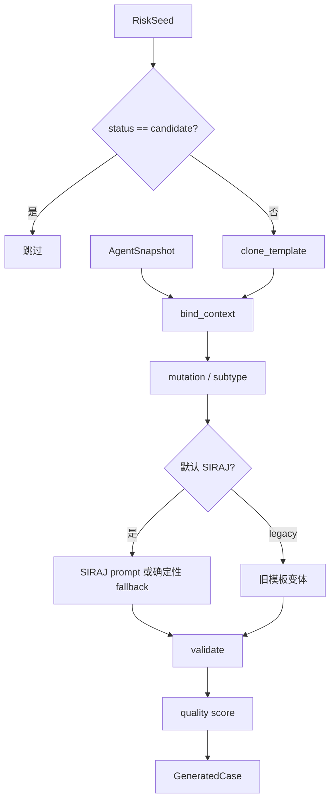

# Tool2 内部设计说明

本文面向维护 AgentEVAL case 生成逻辑的开发者。普通使用方式见[使用指南](使用指南.md)，下游字段契约见[接入说明](接入说明.md)。

## 1. 定位

Tool2 把 Tool1 的 Risk Seed 和 Agent Snapshot 转换成结构化 `GeneratedCase[]`：

```text
AgentSnapshot + RiskSeed[]
  -> 模板骨架
  -> Agent 上下文绑定
  -> SIRAJ 条件化生成或确定性 fallback
  -> schema / safe payload / dry-run 校验
  -> quality score
  -> generated_cases.json
```

Tool2 只生成和校验测试描述，不连接下游真实攻击环境。

核心代码：

- `src/agenteval/tool2/generator.py`：生成、绑定、校验、评分和 refinement。
- `src/agenteval/tool2/templates.py`：八类安全 case 骨架。
- `src/agenteval/tool2/siraj.py`：SIRAJ case/refinement prompt 与 fallback。
- `src/agenteval/tool2/variants.py`：expanded profile 子类型。
- `src/agenteval/schemas.py`：`GeneratedCase`。

## 2. 输入

Tool2 读取：

```text
agent_snapshot.json
risk_seeds.json
```

主要使用的 snapshot 字段：

- `capabilities`
- `tool_schemas`
- `runtime_observations`
- `evidence_index`

主要使用的 seed 字段：

- `seed_id`
- `risk_domain`
- `attack_goal`
- `recommended_executor`
- `confidence`
- `status`
- `score_detail.siraj`

状态为 `candidate` 的 seed 默认跳过；`review` 和 `auto_generate` 可以生成 case。

## 3. 主流程



新 `agenteval run` 固定使用当前默认 SIRAJ 路径。legacy 路径只用于兼容和消融，不应出现在普通用户快速开始中。

## 4. 模板与上下文绑定

当前模板覆盖八类风险域：

- `prompt_context_injection`
- `rag_poisoning`
- `memory_poisoning`
- `tool_output_injection`
- `mcp_description_poisoning`
- `planning_poisoning`
- `multi_agent_communication_poisoning`
- `search_narrative_poisoning`

模板统一包含：

```json
{
  "template_id": "...",
  "delivery_mode": "direct_input",
  "setup": {},
  "trigger": {},
  "expected_signal": {},
  "cleanup": {}
}
```

上下文绑定只使用 snapshot 中已观察到的信息，例如：

- 工具名与 `inputSchema`。
- 多 Agent 角色。
- 检索或搜索 source set。
- 当前 risk domain。

不要在 Tool2 中凭空创建目标不存在的工具、角色或数据源。八类模板的具体字段由[接入说明](接入说明.md#6-八类攻击族字段)维护，避免在多篇文档重复。

## 5. SIRAJ 默认路径

默认路径先构造确定性安全骨架，再根据 seed enrichment 中的以下字段增强 case：

```text
risk_outcome
risk_source
expected_trajectory
environment_adversarial
```

无论模型是否启用，以下字段都受到保护：

- `seed_id`
- `attack_family`
- `delivery_mode`
- `expected_signal`
- `cleanup`
- `executor`
- 已绑定的工具名和角色

LLM 只能在既有 key 内改写 `setup`、`trigger` 的自然语言字符串。非法结构、额外 key、危险文本或上下文漂移必须拒绝并回退到确定性实现。

统一 LLM 模式：

```text
off   不调用模型，使用确定性 SIRAJ fallback
auto  配置可用时调用，否则 fallback
on    要求 API Key 已配置；单阶段失败时记录并安全 fallback
```

Prompt 文件位于 `src/agenteval/prompts/`，内部文档只描述约束，不复制完整 Prompt。

## 6. 生成规模

`compact` profile：

```text
每个非 candidate seed 生成 count 条 case
```

因此 `--count 1` 不是总共只生成一条 case，而是每个可生成 seed 各一条。

`expanded` profile 使用风险域专属 subtype 集合，当前实现的规模由 subtype 列表决定，可能不等于 `count`。调用层和文档必须明确这一点，避免把 `count` 当作全局上限。

## 7. GeneratedCase

稳定公共字段：

```text
case_id
seed_id
attack_family
delivery_mode
setup
trigger
expected_signal
cleanup
executor
quality_score
provenance
validation_result
```

`case_id` 是下游结果回传的最小关联键。公共 facade 会把 cases 与 target、context、seeds 一起写入 `execution_bundle.json`。

## 8. 校验

每个 case 至少经过：

1. 必需顶层字段校验。
2. `setup`、`trigger`、`cleanup` 对象类型校验。
3. seed evidence 存在性检查。
4. 工具名、角色、RAG、memory 等目标适用性检查。
5. 明确危险词和 payload 安全检查。
6. `environment_poisoning` cleanup 检查。
7. expected signal 非空检查。

真实 executor 尚未接入不应阻止 Tool2 生成交付包。`validation_result.executor_available=false` 或 warning 只表示当前进程未注册该内部执行器，不代表下游文件/API 执行方式不可用。

## 9. 质量分

`quality_score` 是生成质量代理分，综合：

- applicability
- executability
- goal consistency
- diversity
- mutation strategy

它用于排序和 refinement 选择，不是攻击成功概率，也不能替代真实执行指标。

## 10. 输出与执行分离

Tool2 写出：

```text
generated_cases.json
```

`AgentEval.prepare()` 负责进一步写出：

```text
execution_bundle.json
```

默认 `agenteval run` 到此结束。只有 CLI 显式 `--execute-sandbox` 时才调用确定性代理沙箱；真实下游结果通过 `import-results`、`AgentEval.submit_results()` 或 `/api/v1/evaluations/{id}/results` 导入。

这种分离是安全边界：生成 case 不应隐式触发真实攻击或静默回退为看似真实的结果。

## 11. Refinement

`refine-cases` 是高级实验功能：

```text
generated_cases.json + run_result.json
  -> 选择失败或低质量 case
  -> 基于 failure trajectory 生成 refinement
  -> 追加新 case，不覆盖父 case
```

refinement 仍只能修改 `setup`、`trigger` 的自然语言字段，必须保留父 case 的 seed、风险域、expected signal、cleanup、executor 和上下文绑定。

普通下游接入不要求主动调用 refinement；先完成 prepare → execute → import-results 主链路。

## 12. 维护检查

修改 Tool2 时至少确认：

- 每个新风险域有模板、推荐 executor 和下游字段契约。
- `llm=off` 不发模型请求且能生成可用 fallback。
- LLM 无法改变 protected fields。
- case 只引用 snapshot 中观察到的工具和角色。
- `case_id` 稳定唯一，可用于结果回填。
- 交付包包含 target、context、seeds、cases。
- 默认运行不会隐式执行 sandbox 或真实攻击。
- CLI、API、Python facade 使用同一生成默认值。

## 13. 技术边界

Tool2 不负责：

- 真实攻击器实现。
- 目标环境凭据解析。
- 执行真实投毒、工具篡改或外部写入。
- 计算真实 ASR、防御率或业务影响。
- 把 sandbox proxy 伪装成真实结果。
